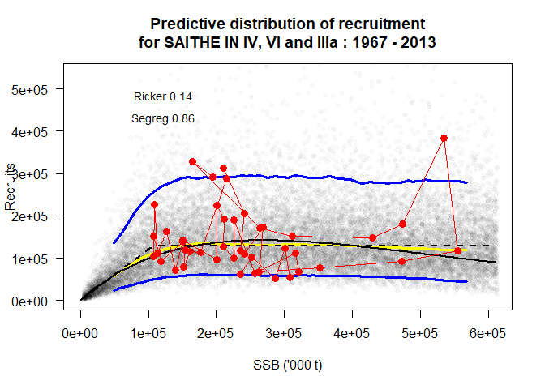
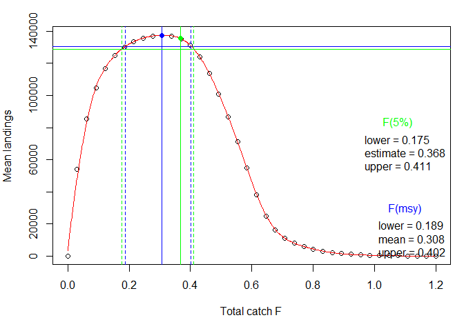
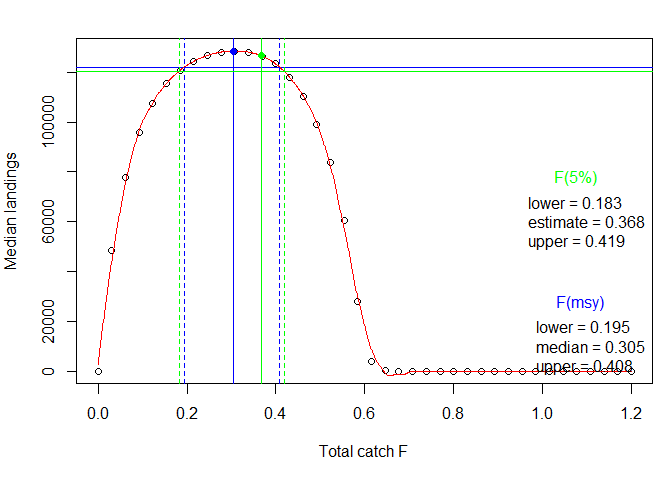
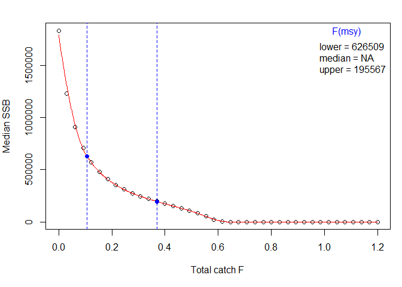
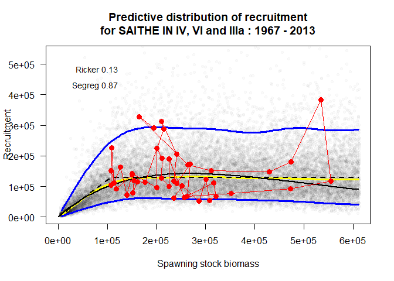
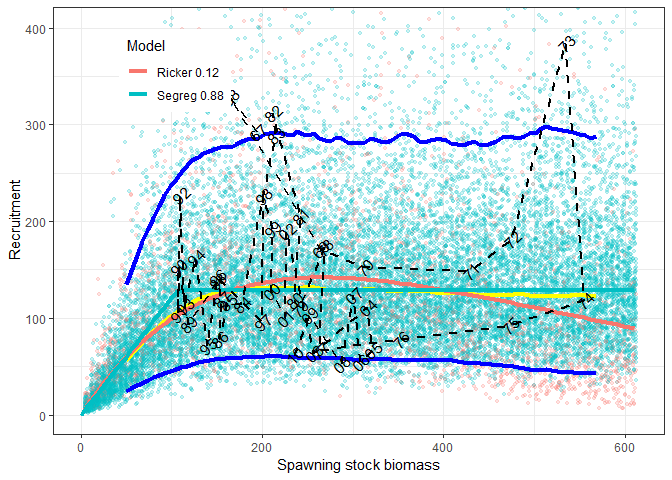

[](https://travis-ci.org/ices-tools-prod/msy)
[](https://github.com/ices-tools-prod/msy/tree/0.2-0)
[](https://cran.r-project.org/package=msy)
[](https://cran.r-project.org/package=msy)
[-blue.svg)](https://www.gnu.org/licenses/gpl-3.0.en.html)

# msy

The `msy` R package is a collection of methods to estimate equilibrium
reference points for fish stocks

## Contact

You are welcome to:

  - submit suggestions and bug-reports at:
    <https://github.com/ices-tools-prod/msy/issues>
  - send a pull request on: <https://github.com/ices-tools-prod/msy>

# Preamble

This document is as much as the `msy`-package itself a living document.

The origin of this package is from an intial coding by John Simmonds
which was restructured by Colin Millar into an R-package with additional
development, including coding the Buckland method. Einar Hjörleifsson
compartmentalized the structure of the code as well as providing the
output of the analysis in a more structured format. Further
contributions have been made by Carmen Fernandez, Max Cardinale, Martin
Pastoors and Niels Hintzen.

The package is currently being maintianed by the ICES secretariat.

# Installation

The developmental repository for the `msy` package is located on
[github](https://github.com), more specifically on
[github.com/ices-tools-prod/msy](https://github.com/ices-tools-prod/msy)

The easiest way to install the `msy` package is to use the function
`install_github` in the `devtools` package. Since the input into the msy
is in the form of a `FLStock` object it is advised to obtain the latest
release of `FLCore` from the same site.

The [`Rtools.exe`](http://cran.at.r-project.org/bin/windows/Rtools)
software is needed for building packages under Microsoft Windows.

Run the following lines to install the latest versions of `msy` and
`FLCore`.

``` r
# install.packages("devtools")
install.packages("FLCore", repo = "http://flr-project.org/R")
library(devtools)
install_github("ices-tools-prod/msy")
```

The above is equivalent to `install.packages` and hence need only to be
performed once. However, since the `msy` package is currently under
development (including bug-fixing) one may expect more frequent code
updating in the package than what one may be familiar with for packages
on `CRAN`. Once installed the `msy` packages is simply loaded via the
familiar:

``` r
library(msy)
```

Besides functions the package comes with the following data:

  - codCS: `FLStock` object of the Celtic Sea cod
  - codEB: `FLStock` object of the Eastern Baltic cod
  - codIS: `FLStock` object of the Icelandic cod
  - codNS: `FLStock` object of the North Sea cod
  - codWB: `FLStock` object of the Western Baltic cod
  - codWS: `FLStock` object of the West of Scotland cod
  - saiFO: `FLStock` object of the Faeroe saithe
  - saiIS: `FLStock` object of the Icelandic saithe
  - solKA: `FLStock` object of the Kattegat sole

These are all stored in the icesStocks list object.

The current version of the `msy` implements two methods that go under
the working names `eqsim` and `plotMSY`. Only usage of functions for the
`eqsim` approaches are described in the following sections.

# eqsim

`eqsim` is a stochastic equilibrium software that may be used to explore
MSY reference points. Productivity parameters (i.e. year vectors for
natural mortality, weights-at-age and maturities) as well as selection
are re-sampled at random from user specified range of years from the
assessment. Fixing these parameters to an average over specified years
can also be set by the user. Recruitments are re-sampled from their
predictive distribution. Uncertainty in the stock-recruitment model is
taken into account by applying model averaging using smooth AIC weights
(Buckland et al. 1997). In addition assessment errors can be emulated by
applying a user-specified error (CV and autocorrelation) to the intended
target fishing mortality.

The current version of `eqsim` only takes `FLStock` objects as inputs.

## A quick start

In the following subsections we will simulate the north sea cod stock
into the future under some basic assumptions. For the simulations we
need to choose which years we will use to generate noise in the
quantities: weight at age, maturity at age, natural mortality at age,
and selection pattern. We also need to choose a set of Fbar values to
simulate over in order estimate F reference points.

The eqsim approach consists of three components:

1.  Estimate the stock recruitment relationship
2.  Simulate a stock to equilibrium and continue simulating for some
    years
3.  Calculate reference points from the simulated stock at equilibrium
    (last 50 years of the runs are used)

This can be done in one go with the following code:

``` r
FIT <- eqsr_fit(icesStocks$saiNS,
  nsamp = 1000,
  models = c("Ricker", "Segreg")
)
SIM <- eqsim_run(FIT,
  bio.years = c(2004, 2013),
  sel.years = c(2004, 2013),
  Fcv = 0.24,
  Fphi = 0.42,
  Blim = 106000,
  Bpa = 200000,
  Fscan = seq(0, 1.2, len = 40),
  verbose = FALSE
)
```

The stock recruitment function can be plotted by:

``` r
eqsr_plot(FIT,n=2e4)
```

<!-- -->

Summary of the key results can be obtained by:

``` r
SIM$Refs
```

``` 
                  F05          F10          F50    medianMSY      meanMSY     FCrash05
catF     3.745647e-01 4.026805e-01 5.044966e-01 3.076923e-01 3.076923e-01 4.923077e-01
lanF               NA           NA           NA 3.076923e-01 3.076923e-01           NA
catch    1.269144e+05 1.240353e+05 9.676671e+04 1.291093e+05 1.291093e+05 1.019306e+05
landings           NA           NA           NA 1.291093e+05 1.291093e+05           NA
catB     2.070386e+05 1.842420e+05 1.058974e+05 2.685973e+05 2.685973e+05 1.150066e+05
lanB               NA           NA           NA 2.685973e+05 2.685973e+05           NA
             FCrash50
catF        0.6461538
lanF               NA
catch    1986.8567802
landings           NA
catB     1551.6680629
lanB               NA
```

Summary plots conditioned on maximizing **catch** are obtained by:

``` r
eqsim_plot(SIM,catch=TRUE)
```

<!-- -->

Summary plots of **Fmsy range** (WKMSYREF3) are obtained by:

``` r
eqsim_plot_range(SIM, type="mean")
```

<!-- -->

``` r
eqsim_plot_range(SIM, type="median")
```

<!-- -->

``` r
eqsim_plot_range(SIM, type="ssb")
```

<!-- -->

## The recruitment model

Model fitting is done by maximum likelihood using the `nlminb` optimiser
in R. By refitting to non-parametric bootstrap resamples of the stock
and recruit pairs, samples from the approximate joint distribution of
the model parameters can be made. This is done by invoking the
`eqrs_fit` function. The function first sets up the stock and recruit
pairs based on the information in the `FLStock` object and removes any
incomplete pairs, before dispatching on the model fitting / averaging
algorithm chosen. Currently only a bootstrap based model averaging
method called smooth AIC is implemented fully. The details can be found
in `eqrs_Buckland` function. The algorithm implemented is:

1.  Take a resample with replacement from the stock and recruit pairs
2.  Fit every stock-recruit model under consideration and store the AIC
    of each
3.  Retain the parameter estimates from the best model
4.  Repeat

This process provides a robust way to average over several models, as
long as the bootstrap resampling procedure provides an adequate
approximation to the empirical distribution of the stock and recruit
pairs.

The arguments to the fitting function are

``` r
args(eqsr_fit)
```

    function (stk, nsamp = 1000, models = c("Ricker", "Segreg", "Bevholt"), 
        id.sr = FLCore::name(stk), remove.years = NULL, rshift = 0) 
    NULL

Here:

  - `stk` is an `FLStock` object
  - `nsamp` is the number of simulations to run (often referred to as
    iterations)
  - `models` is the models to average over (any of the combination of
    these can be supplied, including only a single model)
  - `method` the method used (only Buckland as of now)
  - `id.sr` placeholder if one wants to name the fit
  - `remove.years` is used to remove years from the fit
  - `delta` and `nburn` are related to an MCMC based fitting procedure
    (not implemented)

The results from the fitting process are returned to the user as a list:

``` r
str(FIT, 2, give.attr=FALSE)
```

    List of 5
     $ sr.sto:'data.frame': 1000 obs. of  4 variables:
      ..$ a    : num [1:1000] 1.16 1.603 1.034 2.147 0.919 ...
      ..$ b    : num [1:1000] 9.59e+04 8.70e+04 1.28e+05 5.40e-06 1.59e+05 ...
      ..$ cv   : num [1:1000] 0.475 0.502 0.435 0.48 0.503 ...
      ..$ model: chr [1:1000] "Segreg" "Segreg" "Segreg" "Ricker" ...
     $ sr.det:'data.frame': 2 obs. of  7 variables:
      ..$ a    : num [1:2] 1.44 1.21
      ..$ b    : num [1:2] 3.74e-06 1.06e+05
      ..$ cv   : num [1:2] 0.521 0.492
      ..$ llik : num [1:2] -33.7 -31.2
      ..$ model: chr [1:2] "Ricker" "Segreg"
      ..$ n    : 'table' int [1:2(1d)] 127 873
      ..$ prop : 'table' num [1:2(1d)] 0.127 0.873
     $ stk   :Formal class 'FLStock' [package "FLCore"] with 20 slots
     $ rby   :'data.frame': 44 obs. of  8 variables:
      ..$ year        : int [1:44] 1967 1968 1969 1970 1971 1972 1973 1974 1975 1976 ...
      ..$ rec         : num [1:44] 291836 327932 171373 152852 148741 ...
      ..$ ssb         : num [1:44] 194228 164413 263979 311949 429606 ...
      ..$ fbar        : num [1:44] 0.322 0.291 0.262 0.408 0.329 ...
      ..$ landings    : num [1:44] 113751 88326 130588 234962 265381 ...
      ..$ catch       : num [1:44] 113751 88326 130588 234962 265381 ...
      ..$ ssb_lag     : num [1:44] 3 3 3 3 3 3 3 3 3 3 ...
      ..$ remove.years: logi [1:44] FALSE FALSE FALSE FALSE FALSE FALSE ...
     $ id.sr : chr "SAITHE IN IV, VI and IIIa : 1967 - 2013"

where:

  - `sr.sto` is the the (joint) stochastic distribution of the estimated
    model and parameters. The number of rows of the data frame is
    equivalent to the value supplied to `nsamp` in the `eqsr_fit`
    function.
  - `sr.det` is the conventional determinimstic predictive estimate. The
    `n` indicates the number of times a particular function is drawn in
    the stochastic sample and the `prop` the proportion, given `nsamp`.
  - `pRec` contains the fitted parameters to the observed data
  - `stk` retains the original `FLStock` object passed to the function.
  - `rby` (results by year) contains a summary of the ssb and rec data
    used in the fitting as well as other stock summary information used
    later down the line
  - id.rs\` is the user specified id

The contribution of each of the models can be obtained by printing out
the `sr.det`:

``` r
FIT$sr.det
```

``` 
         a            b        cv      llik  model   n  prop
1 1.443935 3.743708e-06 0.5207246 -33.72180 Ricker 127 0.127
2 1.212853 1.062150e+05 0.4917162 -31.19974 Segreg 873 0.873
```

Here the a, b and cv are the estimated parameters from the deterministic
fit for each model. The `n` and `prop` is a summary of the number and
proportion that each model contributes to the final fit.

Again to obtain a plot one simply calls:

``` r
eqsr_plot(FIT,n=2e4)
```

<!-- -->

The `n` supplied to the `eqsr_plot` stands here for the number of
stochastic recruitment points desired to include in the plot. The
various black dashed lines represent the best fit of the different
recruitment models and the yellow and blue lines the median and 5% and
95% percentiles of the distributions of the stochastic recruits drawn
from the models. The input data are represented by red points.

An alternative to the `base` plot is a `ggplot2` version (with too many
fancy colours :-):

``` r
eqsr_plot(FIT,n=2e4,ggPlot=TRUE,Scale=1e3)
```

<!-- -->

Here the model fits are represented in different colours with the yellow
lines indicating the 5%, 50% and 95% percentiles of the stochastic
recruitment distribution. The input data are represented by text
indicating year class. The weight of each model in the final stochastic
recruitment draw is indicated as a proportion in the legends and by
different colours for the stochastic draws.

# The simulation

Simulating forward is done using the `eqsim_run` function. The function
takes as input the output from the `eqsr_fit` function. Simulations are
run independently for each sample from the distribution of model and
parameters. This is done for a range of \(F_{advisory}\) values. For
example if we scanned over 10 values of \(F_{advisory}\) and had taken
2000 samples from the stock-recruit relationship then 20000 simulations
would be run in total. These simulations are run for 200 years (default,
specified with `Nrun`), and the last 50 years are retained to calculate
summaries, like the proportion of times the stock crashes at a given
\(F_{advisory}\). It is important to note that each simulation is
conditioned on a single stock recruit relationship with fixed parameters
and cv.

Error is introduced within the simulations by generating process error
about the constant stock-recruit fit, and by using variation in
maturity, natural mortality, weight at age and selection estimates. Note
that if there is no variability in these quantities in the stock object
then no variability will be taken in to the simulations. The user can
also specify using average values for these parameters.

The arguments to the simulation function are:

``` r
args(eqsim_run)
```

    function (fit, bio.years = c(-5, -1) + FLCore::dims(fit$stk)$maxyear, 
        bio.const = FALSE, sel.years = c(-5, -1) + FLCore::dims(fit$stk)$maxyear, 
        sel.const = FALSE, Fscan = seq(0, 2, len = 40), Fcv = 0, 
        Fphi = 0, SSBcv = 0, rhologRec = TRUE, Blim, Bpa, recruitment.trim = c(3, 
            -3), Btrigger = 0, Nrun = 200, process.error = TRUE, 
        verbose = TRUE, extreme.trim = c(0, 1), R.initial = mean(fit$rby$rec), 
        keep.sims = FALSE) 
    NULL

where:

  - `fit` is the output list from `eqsr_fit`
  - `bio.years` is the start and end year from which to generate noise
    in maturity, M and weights.
  - `bio.const` is a flag indicating if the average maturity, M and
    weights over the specified years should be used (`TRUE`) or not
    (`FALSE`).
  - `sel.years` is the start and end year from which to generated noise
    in the selection at age
  - `sel.const` is a flag indicating if the average selection over the
    specified years should be used (`TRUE`) or not (`FALSE`).
  - `Fscan` is the range of \(F_{advisory}\) values to scan over
  - `Btrigger` is the location of a modifier of a HCR upon which
    \(F_{advisory}\) becomes linearily reduced. If `Btrigger` is 0
    (default) this is equivalent to a constant F-rule.
  - `Fcv` The assessment error of fishing mortality in the advisory
    year.
  - `Fphi` The autocorrelation of fishing mortality in assessment error
  - `SSBcv` The assessment error in the spawning stock in the advisory
    year
  - `rhologRec` Use or not use autocorrelation in recruitment residuals.
  - `Blim` \(B_{lim}\)
  - `Bpa` \(B_{pa}\)
  - `Nrun` is the number of years to simulate forward (fixed for now is
    that the last 50 years from those are used for summarising
    equilibrium conditions)
  - \`process.error} allows the simulations to be run using the
    predictive distribition of recruitment or the mean recruitment
  - `verbose` controls if progress bar is displayed during the
    simulation
  - `extreme.trim` A numerical vector of length 2 containing the lower
    and upper percentiles. If specified, recruitement values outside
    this range are trimmed (ignored).

The results from the simulation process are returned to the user as a
list

``` r
str(SIM, 2, give.attr = FALSE)
```

    List of 12
     $ ibya         :List of 7
      ..$ Mat  : num [1:8, 1:10] 0 0.15 0.7 0.9 1 1 1 1 0 0.15 ...
      ..$ M    : num [1:8, 1:10] 0.2 0.2 0.2 0.2 0.2 0.2 0.2 0.2 0.2 0.2 ...
      ..$ Fprop: Named num [1:8] 0 0 0 0 0 0 0 0
      ..$ Mprop: Named num [1:8] 0 0 0 0 0 0 0 0
      ..$ west : num [1:8, 1:10] 0.964 1.116 1.382 1.74 2.722 ...
      ..$ weca : num [1:8, 1:10] 0.964 1.116 1.382 1.74 2.722 ...
      ..$ sel  : num [1:8, 1:10] 0.315 1.006 1.186 1.493 1.529 ...
     $ rbya         :List of 8
      ..$ ferr    : num [1:40, 1:50, 1:1000] -0.28 -0.28 -0.28 -0.28 -0.28 ...
      ..$ ssb     : num [1:40, 1:50, 1:1000] 1463551 1095079 854467 690074 573662 ...
      ..$ catch   : num [1:40, 1:50, 1:1000] 0 26722 43462 54887 63368 ...
      ..$ landings: num [1:40, 1:50, 1:1000] 0 26722 43462 54887 63368 ...
      ..$ rec     : num [1:40, 1:50, 1:1000] 142049 142049 142049 142049 142049 ...
      ..$ srmodels:'data.frame':    1000 obs. of  4 variables:
      ..$ Ftarget : num [1:40] 0 0.0308 0.0615 0.0923 0.1231 ...
      ..$ simyears: int [1:50] 151 152 153 154 155 156 157 158 159 160 ...
     $ rby          :'data.frame':  44 obs. of  8 variables:
      ..$ year        : int [1:44] 1967 1968 1969 1970 1971 1972 1973 1974 1975 1976 ...
      ..$ rec         : num [1:44] 291836 327932 171373 152852 148741 ...
      ..$ ssb         : num [1:44] 194228 164413 263979 311949 429606 ...
      ..$ fbar        : num [1:44] 0.322 0.291 0.262 0.408 0.329 ...
      ..$ landings    : num [1:44] 113751 88326 130588 234962 265381 ...
      ..$ catch       : num [1:44] 113751 88326 130588 234962 265381 ...
      ..$ ssb_lag     : num [1:44] 3 3 3 3 3 3 3 3 3 3 ...
      ..$ remove.years: logi [1:44] FALSE FALSE FALSE FALSE FALSE FALSE ...
     $ rbp          :'data.frame':  160 obs. of  10 variables:
      ..$ Ftarget : num [1:160] 0 0.0308 0.0615 0.0923 0.1231 ...
      ..$ variable: chr [1:160] "Recruitment" "Recruitment" "Recruitment" "Recruitment" ...
      ..$ p025    : num [1:160] 18891 24962 31631 35952 39827 ...
      ..$ p05     : num [1:160] 33794 39879 44315 47818 50510 ...
      ..$ p25     : num [1:160] 83657 85233 86814 88085 89255 ...
      ..$ p50     : num [1:160] 121748 122725 123805 124943 125985 ...
      ..$ p75     : num [1:160] 173973 174807 175528 176334 177257 ...
      ..$ p95     : num [1:160] 286156 286896 287753 289175 289647 ...
      ..$ p975    : num [1:160] 336886 338161 339625 340201 340736 ...
      ..$ Mean    : num [1:160] NA NA NA NA NA NA NA NA NA NA ...
     $ Blim         : num 106000
     $ Bpa          : num 2e+05
     $ Refs         : num [1:6, 1:7] 3.75e-01 NA 1.27e+05 NA 2.07e+05 ...
     $ pProfile     :'data.frame':  1104 obs. of  3 variables:
      ..$ Ftarget : num [1:1104] 0.153 0.154 0.156 0.157 0.158 ...
      ..$ value   : num [1:1104] 4.46e-07 1.04e-06 1.84e-06 2.88e-06 4.23e-06 ...
      ..$ variable: chr [1:1104] "pFmsyCatch" "pFmsyCatch" "pFmsyCatch" "pFmsyCatch" ...
     $ id.sim       : chr "SAITHE IN IV, VI and IIIa : 1967 - 2013"
     $ refs_interval:'data.frame':  1 obs. of  8 variables:
      ..$ FmsyMedianC     : num 0.308
      ..$ FmsylowerMedianC: num 0.193
      ..$ FmsyupperMedianC: num 0.41
      ..$ FmsyMedianL     : num 0.308
      ..$ FmsylowerMedianL: num 0.193
      ..$ FmsyupperMedianL: num 0.41
      ..$ F5percRiskBlim  : num 0.375
      ..$ Btrigger        : num 0
     $ rhologRec    : num [1:1000] 0.314 0.314 0.325 0.428 0.354 ...
     $ Refs2        : num [1:6, 1:9] 3.75e-01 NA 1.27e+05 NA 2.07e+05 ...

where

  - `ibya` (input by year and age) contains the biological and fisheries
    input data.
  - `rby` (results by year) contains the stock summary data.
  - `rbp` (results by probability) contains the 0.025, 0.05, 0.25, 0.5,
    0.75, 0.95, 0.975 percentiles of the simulations of SSB, catch,
    landings and recruitment for each Fscan value.
  - `Blim` \(B_{lim}\) input value
  - `Bpa` \(B_{pa}\) input value
  - `Refs` Calculated reference points
  - `pProfile` The probability profiles for a given target F for
    \(B_{lim}\), \(B_{pa}\) and \(F_{msy}\) (both for catch and
    landings).
  - `refs_interval` The \(F_{msy}\) interval and 5% percentile risk of
    going below \(B_{lim}\) (per [WKFMSYREF3](http://www.ices.dk))

The calculation associated with the \(F_{msy}\) range values can be
accessed simply by:

``` r
t(SIM$refs_interval)
```

    ##                       [,1]
    ## FmsyMedianC      0.3075377
    ## FmsylowerMedianC 0.1929648
    ## FmsyupperMedianC 0.4100503
    ## FmsyMedianL      0.3075377
    ## FmsylowerMedianL 0.1929648
    ## FmsyupperMedianL 0.4100503
    ## F5percRiskBlim   0.3745647
    ## Btrigger         0.0000000
